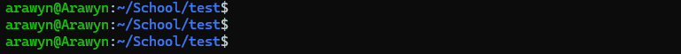
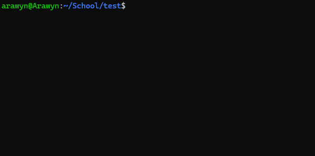

<div align="center">
  <h1>⚙️ pipex (a <a href="https://42perpignan.fr/">42</a> project) ⚙️</h1>
  
  
  <p><b>Subject (in french):</b> <a href="ressources/fr.subject.pdf">fr.subject.pdf</a></p>
</div>
<div align="center">
  <h2>✅ Grade</h2>
  
</div><br>

## <div align="center">📄 Introduction</div>
This project consists in reproducing the behaviour of the pipe `|` in bash.

Done in 42 cursus at 42 Perpignan, in November of 2023 with bonus.

## <div align="center">💾 Installation</div>
In a terminal, type the following command to clone the repository:
```bash
git clone https://github.com/Arawyn42/42_pipex && cd 42_pipex
```
### Normal version
```bash
make && make clean
```

### Bonus version
```bash
make bonus && make clean
```

## <div align="center">💻 Usage</div>
### Normal version
The following command :
```bash
./pipex file1 cmd1 cmd2 file2
```
is the equivalent of the bash command:
```bash
< file1 cmd1 | cmd2 > file2
```
### Bonus version
The bonus build allows multiple pipes, like this:
```bash
./pipex file1 cmd1 cmd2 cmd3 ... cmdN file2
```

It is also possible to perform a **here_doc** pipe, like this:
```bash
./pipex here_doc LIMITER cmd1 cmd2 ... cmdN outfile
```
where LIMITER correspond to the stop keyword of the here_doc. By convention, it's *EOF*, for End Of File.
